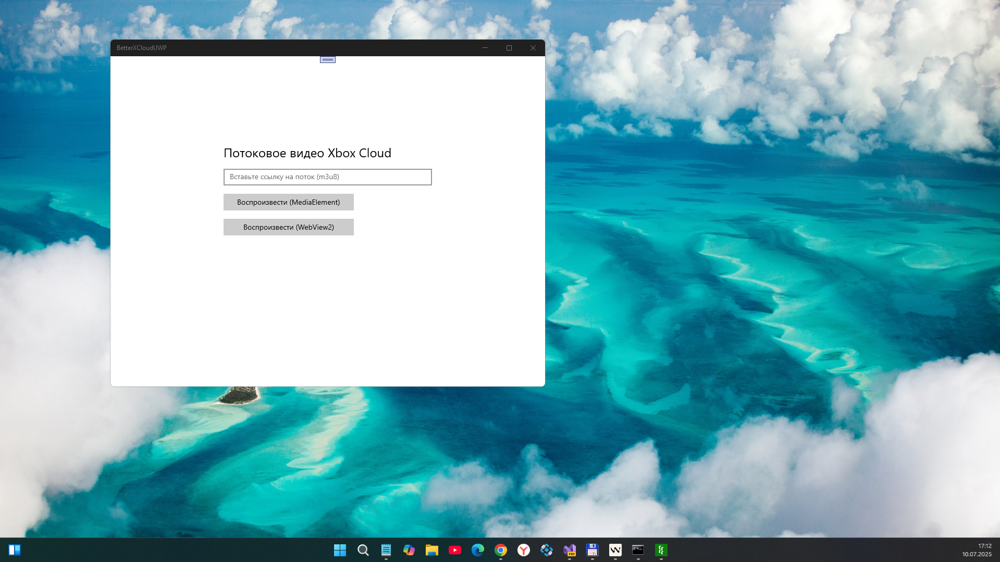

# better-xcloud-uwp - uwp branch

Improve Xbox Cloud Gaming (xCloud) experience on [xbox.com/play](https://www.xbox.com/play). It also allows you to use Remote Play on the xCloud website.  Prototype / Draft / Not ready. This is only my fantazy about better-xcloud UWP edition based on "better-xcloud TypeScript" logics :) Dirty and fast work with help of WindSurf AI IDE. 

> [!IMPORTANT]  
> I only accept pull requests for:
> - Custom touch controls
> - Bug fixes

**Supported platforms:**  
- Windows 10/11 (17xxx)

## Screenshots

## Description ( original , not mine )
This script makes me spend more time with xCloud, and I hope the same thing happens to you.  
If you like this project please give it a 🌟. Thank you 🙏.

### How to install
Visit the [home page](https://better-xcloud.github.io) to know how to install Better xCloud on your device.

### Full documentations
- For the full details please visit: [**better-xcloud.github.io**](https://better-xcloud.github.io)  
- [Demo video](https://youtu.be/hyp69Jrb2sQ)

⚠️ Please DO NOT report **Better xCloud**'s bugs on [/r/xcloud subreddit](https://reddit.com/r/xcloud/). Report bugs in [Issues](https://github.com/redphx/better-xcloud/issues) or [Telegram channel](https://t.me/betterxcloud) instead.

## Acknowledgements  
- The mouse controlling feature is heavily inspired by the "Mouse spinning" feature in [Yuzu emulator](https://github.com/yuzu-emu/yuzu-mainline)
- [n-thumann/xbox-cloud-server-selector](https://github.com/n-thumann/xbox-cloud-server-selector) for the idea of IPv6 feature
- Icons by [Phosphor Icons](https://phosphoricons.com)
- [PromptFont](https://shinmera.com/promptfont) by Yukari "Shinmera" Hafner

## Disclaimers  
- Use it at your own risk.
- This project is not affiliated with Xbox in any way. All Xbox logos/icons/trademarks are copyright of their respective owners.

## References
- https://github.com/redphx/better-xcloud
- https://learn.microsoft.com/en-us/gaming/gdk/docs/services/fundamentals/portal-config/live-service-config-ids-mp
- https://learn.microsoft.com/en-us/windows/uwp/launch-resume/how-to-create-and-consume-an-app-service
- https://learn.microsoft.com/en-us/gaming/gdk/docs/reference/live/rest/atoc-xboxlivews-reference Xbox services RESTful reference
- https://learn.microsoft.com/en-us/gaming/gdk/docs/services/develop/best-practices/live-best-practices-calling-xbl 
- https://news.xbox.com/en-us/idatxbox/ 
- https://developer.microsoft.com/en-US/games/publish 
- https://github.com/microsoft/xbox-live-api
- https://github.com/microsoft/xbox-live-samples

## ..
- AS-IS. No support. Research theme only!

## .
[M][E] 2025 